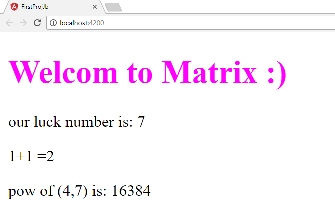

#   Angular First Project 
---
## Project goals
* creating and running basic angular project
* using basic interpolation (with `{{}}`)

## Proj1 generating

This project was generated with [Angular CLI](https://github.com/angular/angular-cli) version 6.0.0.

## Running the project (on local mode)

* Run `npm init` to install all the requiered packages from `package.json`
* Run `ng serve` to visit this site at `localhost:4200`

## Project screenshot
